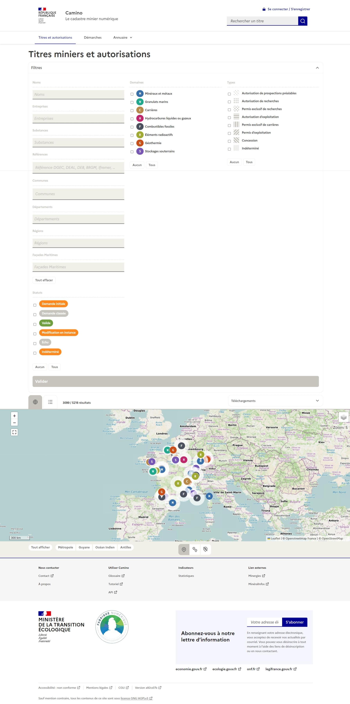

# Camino

[](https://github.com/MTES-MCT/camino/actions/workflows/ui-ci.yml) [](https://github.com/MTES-MCT/camino/actions/workflows/api-ci.yml) [![codecov][codecov-img]][codecov]

[codecov-img]: https://codecov.io/gh/MTES-MCT/camino/branch/master/graph/badge.svg
[codecov]: https://codecov.io/gh/MTES-MCT/camino


> Interface web de [Camino](https://camino.beta.gouv.fr), le cadastre minier numérique.



---

## Composants

* [Interface](packages/ui/README.md)
* [API](packages/api/README.md)

---

## Configuration

- Cloner ce repo : `git clone https://github.com/MTES-MCT/camino.git`.
- Renommer le fichier `.env-example` en `.env` et le compléter.

### Installation

```bash
# installe les dépendances
npm ci
```

### Développement

```bash
# lance un serveur de développement de l'api
# accessible à localhost:4000
npm run dev -w packages/api
```

```bash
# lance un serveur de développement de l'interface 
# accessible à localhost:3000
npm run dev -w packages/ui
```

### Production

```bash
# crée les fichiers de production dans le répertoire dist
npm run build -w packages/ui
npm run build -w packages/api

# lance le serveur de production
npm run start -w packages/ui
npm run start -w packages/api
```

### Tests unitaires

```bash
# lance les tests unitaires en local
npm run test
```

---

## Contribution

Voir `contributing.md` (en anglais) pour plus d'infos.

---

## Credits

### Production

- [La Fabrique Numérique, Ministère de la transition écologique](https://www.ecologique.gouv.fr/inauguration-fabrique-numerique-lincubateur-des-ministeres-charges-lecologie-et-des-territoires)

---

## Licence

Camino API, le cadastre minier numérique ouvert

[AGPL 3 ou plus récent](https://spdx.org/licenses/AGPL-3.0-or-later.html)
