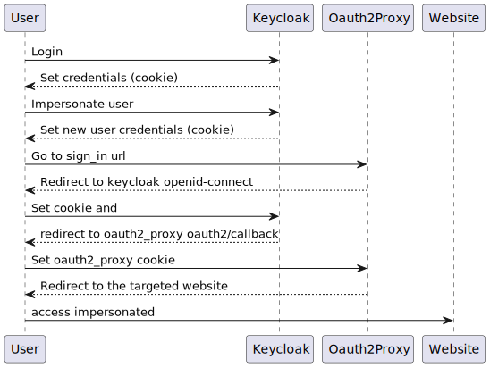

# Utilisateurs

## Usurpation d'identité

Keycloak permet de se faire passer pour un utilisateur.
Nous l'utilisons lors des phases de recette afin de tester tous les profils utilisateurs

Nous voulions l'intégrer directement à l'application mais pour le moment nous n'avons pas réussi et nous avons levé une issue sur le site de oauth2_proxy : https://github.com/oauth2-proxy/oauth2-proxy/issues/2003





## Ajouter un utilisateur sur le serveur

```sh
# créé un utilisateur
sudo adduser -m -d /home/<user> -s /bin/bash <user>
sudo mkdir /home/<user>/.ssh

# ajoute la clé ssh à l'utilisateur et à l'utilisateur git
sudo nano /home/<user>/.ssh/authorized_keys
sudo nano /home/git/.ssh/authorized_keys

# définit les permissions
sudo chmod -R 700 /home/<user>/.ssh/
sudo chown -R <user>:<user> /home/<user>/.ssh

# ajoute l'utilisateur aux groupes sudo, users, docker
sudo usermod -a -G sudo <user>
sudo usermod -a -G docker <user>
sudo usermod -a -G users <user>
```
